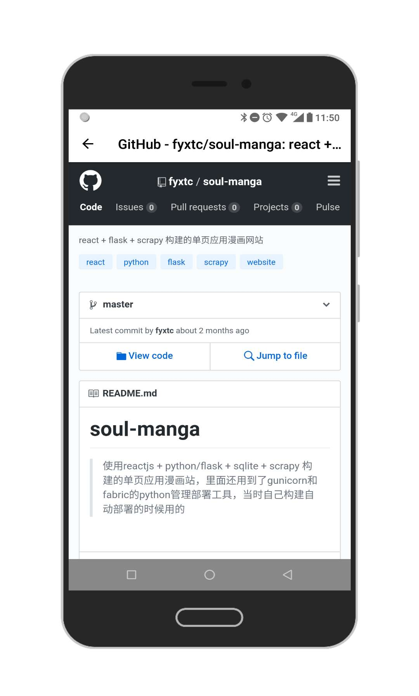

# 干货集中营-Jetpack

## 关于

>  本App是基于谷歌推出的Android Jetpack架构组件的干货集中营, app功能很简单, 基本上是针对 LiveData + ViewModel + Navigation + Paging 的MVVM的练手demo,更多的强大功能，请参考google的官方api

## Architecture

## download

## 截图

## 开源库

- [Retrofit](http://square.github.io/retrofit/)
- [Okhttp](https://github.com/square/okhttp)
- [RxJava2](https://github.com/ReactiveX/RxJava)

Jetpack - Architecture Components架构组件

- [LiveData](https://developer.android.com/topic/libraries/architecture/livedata)
- [ViewModel](https://developer.android.com/topic/libraries/architecture/viewmodel)
- [LifeCycle](https://developer.android.com/reference/android/arch/lifecycle/Lifecycle)
- [Navigation](https://developer.android.com/topic/libraries/architecture/navigation)
- [Paging](https://developer.android.com/topic/libraries/architecture/paging/)

## Sample

- [Android Architecture Components samples](https://github.com/googlesamples/android-architecture-components)
- [MockAppMVVM](https://github.com/Levi-Moreira/MockAppMVVM)

## 相关资料

- [Android Jetpack 之Navigation Architecture Component使用](http://leoncommons.cn/2018/05/18/Android%20Jetpack%20%E4%B9%8BNavigation%20Architecture%20Component%E4%BD%BF%E7%94%A8/)
- [浅谈Android Architecture Components](http://mycommons.cn/2017/09/15/Android-Architecture-Components/#more)
- [Android Jetpack之Paging初探](http://www.loongwind.com/archives/367.html)
- [理解Android Architecture Components系列](https://www.jianshu.com/p/42eb71ec4a19)